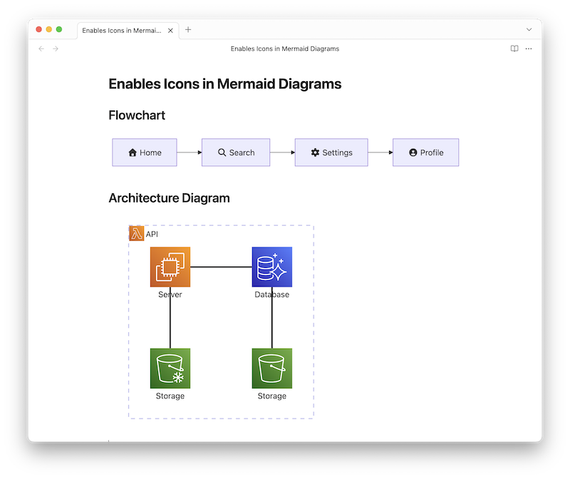
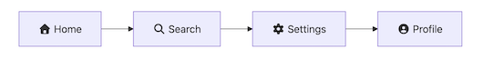

# Obsidian Mermaid Icons Plugin



This plugin for [Obsidian](https://obsidian.md) allows you to easily use a wide variety of icons within your [Mermaid](https://mermaid-js.github.io/mermaid/#/) diagrams.

It not only ensures that the default Font Awesome icons render correctly but also extends functionality to include other icons.

## Features

- **Font Awesome Support:** Correctly displays Font Awesome icons in mermaid diagrams, which are defaultly supported by Mermaid but not to be rendered properly in Obsidian.
- **Expanded Icon Sets:** Adds support for additional icons **pre-bundled with the plugin**, including popular icons, logos, and Lucide icons. (If you want to add more icon sets, please submit a Pull Request!)
- **Icon Insertion Helper:** Easily search and insert icons using a fuzzy search modal (`Cmd+Shift+i`).
- **Icon Browser:** Browse and filter all supported icons directly from the plugin settings.

## How to Use

To include an icon in your Mermaid diagram, use the following syntax:

- `fa[bklrs]?:[icon-name]` for Font Awesome icons.
- `[prefix]:[icon-name]` for other custom icons.
  - Supported prefixes: `logos`, `lucide`.

### Insert Icon Command

You can easily insert icons using the "Insert Mermaid Icon" command:

1.  Press `Cmd+Shift+i` (or `Ctrl+Shift+i` on Windows/Linux) while in the editor.
2.  Type to search for an icon.
3.  Select an icon to insert it into your document.

### Example

Here is a simple Mermaid graph demonstrating how to use the icons:

````

````

This will render a diagram with the corresponding [Font Awesome icons](https://fontawesome.com/icons).




````

````

This will render a diagram with the corresponding [SVG Logos Icon sets](https://icon-sets.iconify.design/logos/).


## Settings

In the plugin settings, you can browse all supported icons under the **Supported icons** section.
- Use the dropdown to filter by icon set (e.g., `logos`, `lucide`).
- Use the search bar to find specific icons by name.

## Installation

### From Community Plugins

1.  Open **Settings** in Obsidian.
2.  Go to the **Community plugins** tab.
3.  Click **Browse** to open the community plugin browser.
4.  Search for "Mermaid Icons".
5.  Click **Install** on the plugin.
6.  Once installed, go back to the **Community plugins** tab and enable "Mermaid Icons".

### Manual Installation

1.  Download `mermaid-icons.zip` from the latest [Releases](https://github.com/toshs/obsidian-mermaid-icons/releases) page on GitHub.
2.  Extract the contents of the downloaded zip file.
3.  Move the extracted `mermaid-icons` folder to your Obsidian vault's plugins folder: `<YourVault>/.obsidian/plugins/`.
4.  Reload Obsidian.
5.  Go to **Settings** -> **Community plugins**, and enable "Mermaid Icons".

## How It Works

This plugin enables icons in Mermaid diagrams within Obsidian by 2 ways:

1.  **Fixing Font Awesome Icons:** When you use the `fa:fa-icon` syntax in Mermaid, it generates the corresponding HTML tag (e.g., `<i class="fa fa-icon">`). However, standard Obsidian does not include the Font Awesome stylesheet or font files. This plugin simply loads the necessary assets, allowing the icons to be displayed as intended.

2.  **Adding Custom Icons:** To support additional icon sets (like brand logos), the plugin uses the Mermaid API to register new icon packs. This allows you to use them with a custom prefix (e.g., `logos:icon-name`) just like you would with the built-in Font Awesome icons.

## License

This project itself is licensed under the MIT License. See the [LICENSE](LICENSE) file for details.

## Acknowledgements

This plugin utilizes the following open-source icon sets. Thank you to their creators and contributors.

- **[Font Awesome Free](https://fontawesome.com/)**

  - **Icons:** Licensed under [CC BY 4.0](https://creativecommons.org/licenses/by/4.0/).
  - **Fonts:** Licensed under [SIL OFL 1.1](https://scripts.sil.org/OFL).
  - **Code:** Licensed under [MIT License](https://opensource.org/licenses/MIT).

- **[Iconify](https://iconify.design/)**
  - **[SVG Logos](https://github.com/gilbarbara/logos)** (`logos`): Licensed under [CC0 1.0 Universal](https://creativecommons.org/publicdomain/zero/1.0/).
  - **[Lucide](https://lucide.dev/)** (`lucide`): Licensed under [ISC License](https://opensource.org/licenses/ISC).
