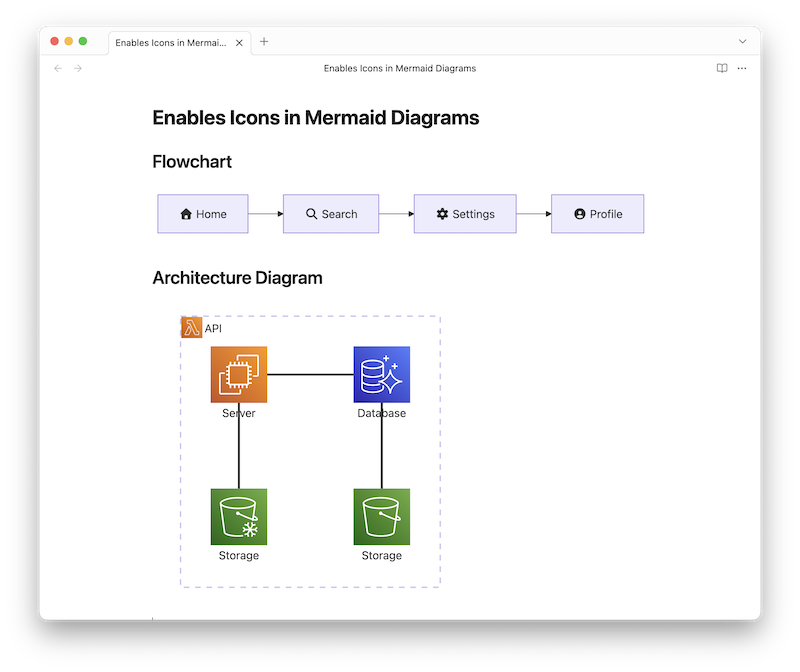
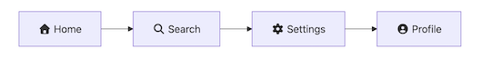

```mermaid
architecture-beta
    group api(logos:aws-lambda)[API]

    service db(logos:aws-aurora)[Database] in api
    service disk1(logos:aws-glacier)[Storage] in api
    service disk2(logos:aws-s3)[Storage] in api
    service server(logos:aws-ec2)[Server] in api

    db:L -- R:server
    disk1:T -- B:server
    disk2:T -- B:db
```

# Obsidian Mermaid Icons Plugin



このプラグインは、[Obsidian](https://obsidian.md)の[Mermaid](https://mermaid-js.github.io/mermaid/#/)ダイアグラム内で、さまざまなアイコンを簡単に使用できるようにするものです。

デフォルトでサポートされているFont Awesomeアイコンが正しく表示されるようにするだけでなく、他のアイコンも使用できるように機能を拡張します。

## 主な機能

-   **Font Awesomeサポート:** MermaidでデフォルトでサポートされていながらObsidianでは正しく表示されないFont Awesomeアイコンを正常に表示します。
-   **拡張アイコンセット:** 人気のアイコンやロゴ、Lucideアイコンなど、追加のアイコンをサポートします。
-   **アイコン入力支援:** ファジー検索モーダル (`Cmd+Shift+i`) を使用して、アイコンを簡単に検索・挿入できます。
-   **アイコンブラウザ:** プラグイン設定画面から、サポートされているすべてのアイコンを閲覧・フィルタリングできます。

## 使い方

Mermaidダイアグラムにアイコンを含めるには、次の構文を使用します。

-   Font Awesomeアイコンの場合: `fa[bklrs]?:[icon-name]`
-   その他のカスタムアイコンの場合: `[prefix]:[icon-name]`
    -   サポートされているプレフィックス: `logos`, `lucide`

### アイコン挿入コマンド

「Insert Mermaid Icon」コマンドを使用して、簡単にアイコンを挿入できます。

1.  エディタ内で `Cmd+Shift+i` (Windows/Linuxの場合は `Ctrl+Shift+i`) を押します。
2.  アイコン名を入力して検索します。
3.  アイコンを選択してドキュメントに挿入します。

### 使用例

アイコンの使用方法を示す簡単なMermaidグラフの例です。

````

````

これにより、対応する[Font Awesomeアイコン](https://fontawesome.com/icons)がMermaid中で表示されます。



````

````

これにより、対応する[SVG Logos Iconのセット](https://icon-sets.iconify.design/logos/)がMermaid中で表示されます。


## 設定

プラグイン設定の **Supported icons** セクションで、サポートされているすべてのアイコンを閲覧できます。
-   ドロップダウンを使用して、アイコンセット（例: `logos`, `lucide`）でフィルタリングできます。
-   検索バーを使用して、名前で特定のアイコンを検索できます。

## インストール方法

### コミュニティプラグインから

1.  Obsidianの**設定**を開きます。
2.  **コミュニティプラグイン**タブに移動します。
3.  **閲覧**をクリックして、コミュニティプラグインブラウザを開きます。
4.  「Mermaid Icons」を検索します。
5.  プラグインの**インストール**をクリックします。
6.  インストールが完了したら、**コミュニティプラグイン**タブに戻り、「Mermaid Icons」を有効にします。

### 手動インストール

1.  GitHubの最新の[Releases](https://github.com/toshs/obsidian-mermaid-icons/releases)ページから `mermaid-icons.zip` をダウンロードします。
2.  ダウンロードしたzipファイルの中身を展開します。
3.  展開した`mermaid-icons`フォルダを、お使いのObsidian vaultのプラグインフォルダに移動します: `<YourVault>/.obsidian/plugins/`。
4.  Obsidianをリロードします。
5.  **設定** -> **コミュニティプラグイン**に移動し、「Mermaid Icons」を有効にします。

## 仕組み

このプラグインは、Obsidian内のMermaidにおいて、2つの方法でアイコンを利用可能にします。

1.  **Font Awesomeアイコンの表示修正:** Mermaidで `fa:fa-icon` という構文を使うと、対応するHTMLタグ（例: `<i class="fa fa-icon">`）が生成されます。しかし、Obsidianの標準状態ではFont Awesomeのスタイルシートやフォントファイルが含まれていません。このプラグインは、それらの必要なアセットを読み込むことで、アイコンが意図通りに表示されるようにします。

2.  **カスタムアイコンの追加:** ブランドロゴなどの追加アイコンセットをサポートするために、このプラグインはMermaid APIを使用して新しいアイコンパックを登録します。これにより、組み込みのFont Awesomeアイコンと同じように、カスタムプレフィックス（例: `logos:icon-name`）を使ってアイコンを利用できます。

## ライセンス

このプロジェクト自体はMITライセンスの下で公開されています。詳細は[LICENSE](LICENSE)ファイルをご覧ください。

## 謝辞

このプラグインは、以下のオープンソースのアイコンセットを利用しています。制作者と貢献者の皆様に心より感謝申し上げます。

-   **[Font Awesome Free](https://fontawesome.com/)**
    -   **アイコン:** [CC BY 4.0](https://creativecommons.org/licenses/by/4.0/) ライセンス
    -   **フォント:** [SIL OFL 1.1](https://scripts.sil.org/OFL) ライセンス
    -   **コード:** [MIT License](https://opensource.org/licenses/MIT) ライセンス

-   **[Iconify](https://iconify.design/)**
    -   **[SVG Logos](https://github.com/gilbarbara/logos)** (`logos`): [CC0 1.0 Universal](https://creativecommons.org/publicdomain/zero/1.0/) ライセンス
    -   **[Lucide](https://lucide.dev/)** (`lucide`): [ISC License](https://opensource.org/licenses/ISC) ライセンス
